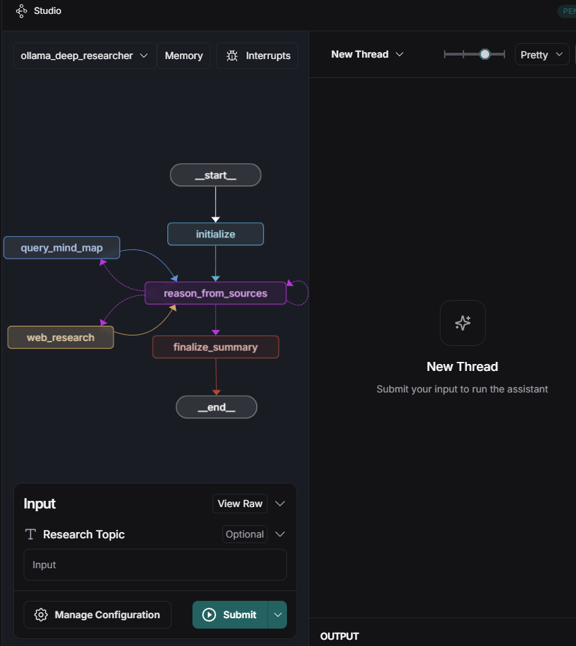

# Mind Map 활용 DeepResearch 프로젝트

### **개요**

DeepResearch를 직접 구현하고 서비스화한 프로젝트입니다. 특히, reasoning 모델의 추론 능력을 향상시키기 위해 **마인드 맵(Mind Map) 방식**을 도입하였습니다.

- **기간:** 2025.02.12 ~ 2025.03.05
- **GitHub:** [링크](https://github.com/HueyVault/mindmap-deep-researcher)
- **배포:** [링크](https://mindmap-deep-researcher-zwnhkrzpwbcuffujvzomts.streamlit.app/)

---

### 사용 도구 및 프레임워크

- **LLM 모델:** Gemini 2.0 Flash (Thinking Exp)
- **프레임워크 및 라이브러리:** LangGraph, Streamlit, Neo4j, UV
- **배포 환경:** Streamlit Cloud

---

### **수행 업무**

- **LangGraph**를 활용하여 **각 Task를 Node로 구분**하고, 이를 연결하여 **Workflow** 구성
- 각 추론 과정을 **Neo4j(Graph DB)에 저장**하여 연구 프로세스를 기록
- LLM이 스스로 판단하여 외부 도구를 활용하도록 프롬프트를 설계하여 외부 도구 호출 토큰을 생성하도록 유도
- 외부 도구 사용 방식
    - **WebSearch:** LLM이 질의를 생성하고, **Tavily API**를 호출하여 웹 검색 수행
    - **MindMap:** LLM이 **Cypher Query**를 생성하여 Neo4j에서 연구 과정을 조회하고, 진행 상황을 확인하도록 구현
- **UV 프로젝트 관리 도구**를 활용하여 작업 진행
- **Streamlit Cloud**를 통해 프로젝트 배포

---

### 화면

<aside>
노드 구성 화면 - LangSmith
</aside>

<aside>
결과 화면
</aside>

<aside>
Streamlit 실행 화면
</aside>

<aside>
Neo4j Graph
</aside>

결과 파일

[연구결과_한국의 2025년 금융 시장 전망에 .md](./document/연구결과_한국의_2025년_금융_시장_전망에_.md)

---

### **문제점 및 개선 방향**

**문제점**

- 성과 지표를 정의하고 측정하는 것이 어려움
- 기존 방식보다 개선되었음을 입증하는 데 높은 비용 발생

**개선 방향**

- 성과 지표를 정의 하고 **비용이 적게 드는 방식**으로 설정 하여 성과를 측정
- 연구용 AI 에이전트가 아닌 **문제를 직접 해결하는 AI 에이전트**로 주제 변경 (예: Code Agent, Game Agent)

---

### **참고 자료**

- https://github.com/langchain-ai/ollama-deep-researcher
- [https://arxiv.org/abs/2502.04644](https://arxiv.org/abs/2502.04644)